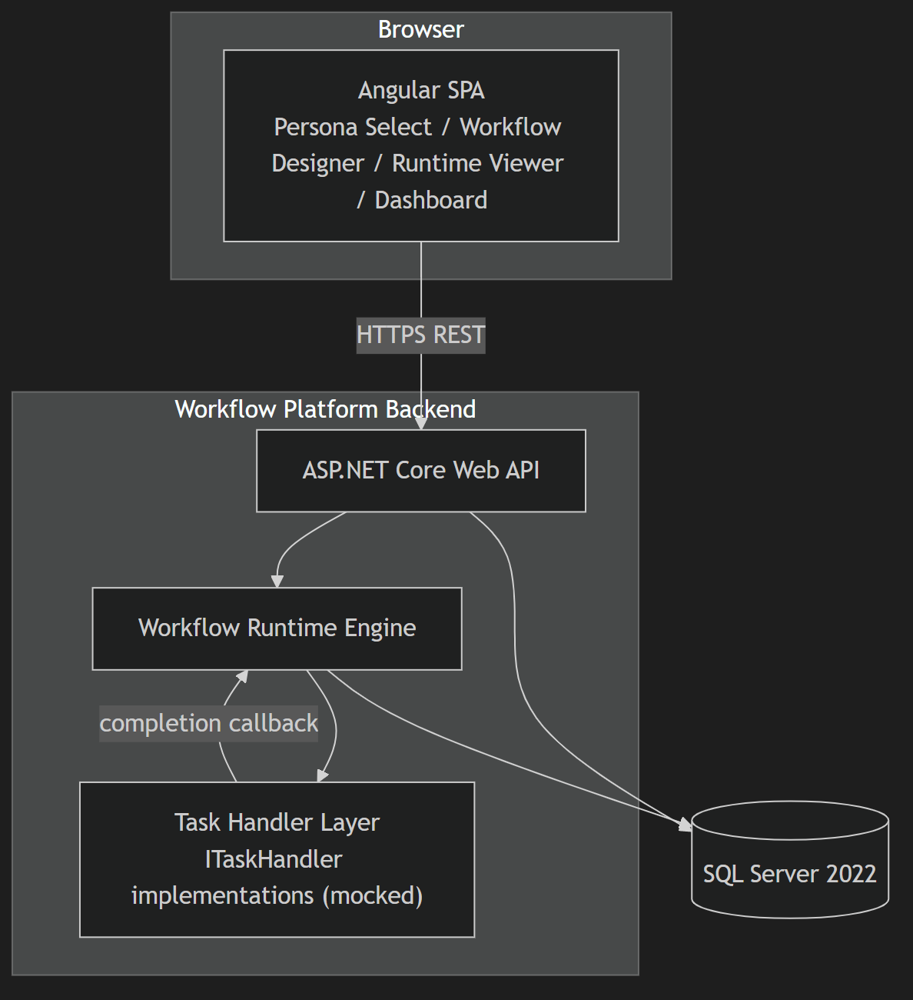
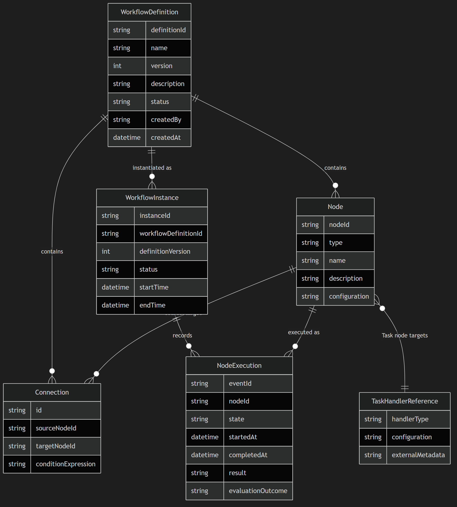
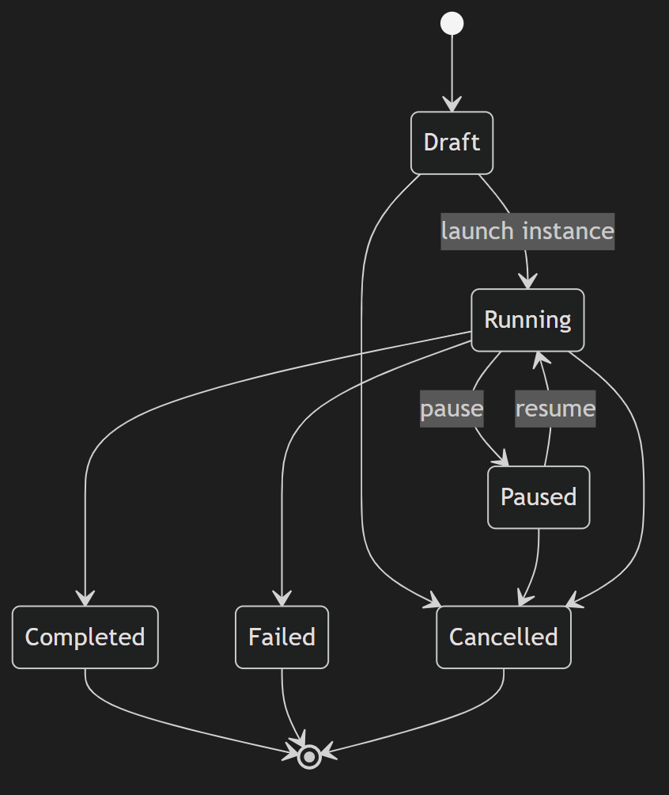
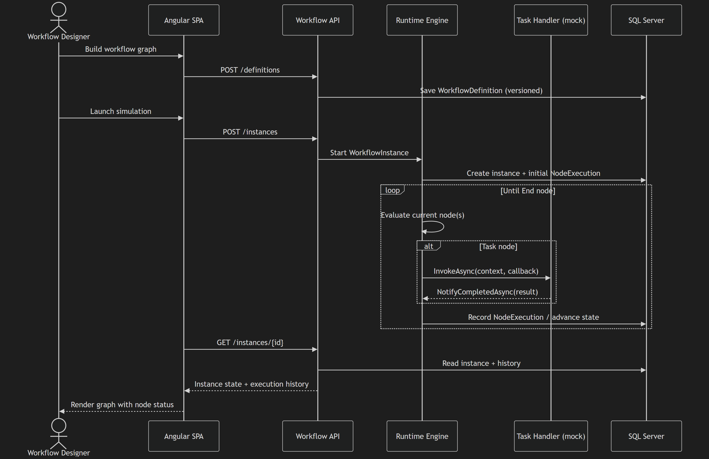
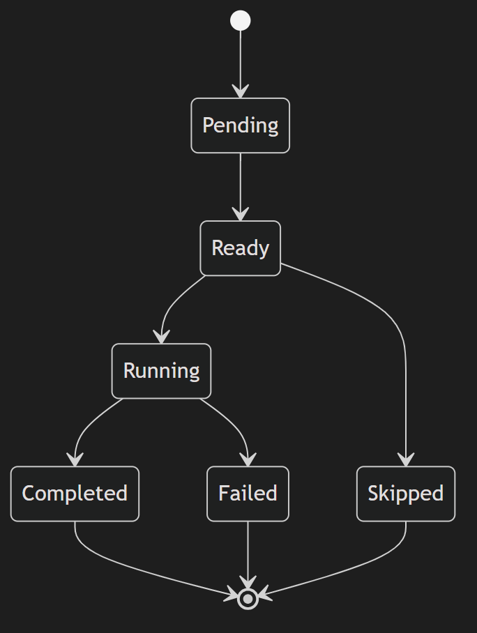

# Architecture: Workflow Visualization and Execution Platform POC

> Status: APPROVED
> Version: v5
> Last updated: 2026-08-12
> PRD: docs/prd.md (built against v5)

## 1. System Context

Users access the platform through a browser running the Angular single-page application. On entry, users select a persona (Workflow Designer, Process Owner, or Operations Analyst); only the Workflow Designer experience is fully built in this tranche (per PRD v4) — the other two personas are shown but not selectable (greyed out) until built. The Angular client talks to a single ASP.NET Core Web API over HTTPS. The API delegates workflow execution to a Workflow Runtime Engine, which invokes pluggable Task Handlers (mocked for this POC) and persists all definitions, instances, and execution history in SQL Server 2022.

Diagram type chosen: a context-style component graph (`graph TB` with subgraphs), since this is a small enough system that a full C4 notation would add ceremony without added clarity.

## 2. High-Level Architecture

Four cooperating parts:

- **Angular Web Client** — persona selection, workflow design, runtime visualization, and dashboard views.
- **Workflow API** (ASP.NET Core) — the only entry point the client talks to; hosts the Workflow Definition Service and fronts the Runtime Engine.
- **Workflow Runtime Engine** — owns instance lifecycle, branching/loop/parallel evaluation, and task-handler invocation.
- **Task Handler Layer** — a real, swappable abstraction (see ADR-004) that the engine calls into for Task nodes; POC ships mock implementations only.

All state (definitions, instances, execution history) lives in SQL Server 2022, accessed via EF Core.

## 3. Components

### Angular Web Client
- **Responsibility:** Persona-selection entry screen; Workflow Designer graph editor; runtime visualization (node status, current position, completed/skipped paths); dashboard (workflow/instance counts and drill-in).
- **Inputs:** User interaction; JSON responses from the Workflow API.
- **Outputs:** REST calls to create/update/version definitions, start instances, and fetch instance/dashboard state.
- **Dependencies:** Workflow API.
- **Technology:** Angular (latest stable), Angular Material, custom theme per ADR-006 (supersedes ADR-005).

### Workflow API
- **Responsibility:** REST surface for definitions, instances, and dashboard metrics; request validation; the only component the client is aware of.
- **Inputs:** HTTP requests from the Angular client.
- **Outputs:** JSON responses.
- **Dependencies:** Workflow Definition Service, Workflow Runtime Engine, Data Store.
- **Technology:** ASP.NET Core (.NET 10 LTS) Web API — see ADR-002.

### Workflow Definition Service
- **Responsibility:** Create, persist, and version `WorkflowDefinition` graphs (nodes, connections, metadata) independently of runtime instances.
- **Inputs:** Definition payloads from the API.
- **Outputs:** Persisted, versioned definitions.
- **Dependencies:** Data Store.
- **Technology:** ASP.NET Core service layer + EF Core.

### Workflow Runtime Engine
- **Responsibility:** Manage `WorkflowInstance` lifecycle; evaluate current node(s), conditions, loops, and parallel split/merge; invoke Task Handlers for Task nodes; record `NodeExecution`/history entries; advance or terminate instances.
- **Inputs:** Instance-start requests; completion/failure callbacks from Task Handlers.
- **Outputs:** Instance state transitions; execution history records.
- **Dependencies:** Task Handler Layer, Data Store.
- **Technology:** ASP.NET Core domain/service logic (.NET 10 LTS).

### Task Handler Layer
- **Responsibility:** Perform the actual (simulated, for POC) work behind a Task node, fully decoupled from the engine's execution logic.
- **Inputs:** `TaskInvocationContext` supplied by the engine.
- **Outputs:** Completion or failure notification back to the engine via callback — not a direct return value (see ADR-004).
- **Dependencies:** None (deliberately pluggable). POC registers mock implementations only (e.g. SendEmail, CreateInvoice, ValidateRecord, HumanApproval-style stubs), drawn from the earlier draft's Task Abstraction notes.
- **Technology:** .NET interfaces `ITaskHandler` / `ITaskCompletionCallback`.

### Data Store
- **Responsibility:** Durable storage for `WorkflowDefinition`, `Node`, `Connection`, `WorkflowInstance`, and `NodeExecution`/execution-history records.
- **Inputs:** Writes from the API and Runtime Engine.
- **Outputs:** Reads for the API and dashboard.
- **Dependencies:** None.
- **Technology:** SQL Server 2022 via EF Core — see ADR-003.

## 4. Domain Model

Absorbed from the earlier draft (docs/workflow-platform-prd.md §8/§9), which had this detail but wasn't yet reflected here.

### Node Types

| Node Type | Purpose |
|-----------|---------|
| Start | Single entry point of a workflow definition |
| End | Terminal point; instance reaches a completed/failed/cancelled outcome |
| Task | Invokes a Task Handler via `ITaskHandler.InvokeAsync` (ADR-004) |
| Condition (If/Else) | Binary branch based on an expression evaluated against instance/node data |
| Switch | Multi-way branch based on an expression |
| Loop | Repeats a sub-path until a condition is met |
| Parallel Split | Fans out execution into concurrent branches |
| Parallel Merge | Joins concurrent branches back together before continuing |
| Wait / Pause | Suspends the instance pending a time delay or external signal |
| Manual Approval | Suspends the instance pending a human decision — modeled as a Task node targeting a HumanApproval-style handler (ADR-004), not a distinct engine primitive |

### Entity Schema

- **WorkflowDefinition** — `definitionId`, `name`, `version`, `description`, `status`, `createdBy`, `createdAt`, `nodes[]`, `connections[]`, `metadata`
- **Node** — `nodeId`, `type` (see Node Types above), `name`, `description`, `configuration`, `incomingConnectionIds[]`, `outgoingConnectionIds[]`
- **Connection** — `id`, `sourceNodeId`, `targetNodeId`, `conditionExpression` (optional; used by Condition/Switch nodes)
- **WorkflowInstance** — `instanceId`, `workflowDefinitionId`, `definitionVersion`, `status` (see Workflow Instance Lifecycle below), `currentNodeIds[]`, `startTime`, `endTime`, `executionHistory[]`
- **NodeExecution** (execution-history entry) — `eventId`, `nodeId`, `state` (Pending/Ready/Running/Completed/Failed/Skipped — matches the rendered node-lifecycle diagram), `startedAt`, `completedAt`, `result`, `evaluationOutcome` (for Condition/Switch nodes)
- **TaskHandlerReference** — `handlerType`, `configuration`, `externalMetadata`

Diagram type chosen: an ER diagram, since this section is specifically about data shape and relationships — a flowchart would obscure that.

### Workflow Instance Lifecycle

Distinct from node-level state (§5): a `WorkflowInstance` itself moves through `Draft → Running → Completed/Failed`, with `Paused` and `Cancelled` as additional reachable states — absent from the current diagram set until now.

Diagram type chosen: a state diagram, for the same reason as the node-lifecycle diagram in §5.

### Condition Evaluation State

A Condition or Switch node's `NodeExecution.evaluationOutcome` field moves from `Pending` (not yet evaluated) to `Evaluated`, at which point the computed outcome is stored and shown in the runtime viewer alongside the node's status.

## 5. Data Flow

Primary use case: author a workflow, then simulate an instance of it.

1. User selects "Workflow Designer" on the persona-selection screen.
2. Designer builds a node graph in the Angular editor and saves it — the client `POST`s to the API, which persists a versioned `WorkflowDefinition` via the Definition Service.
3. Designer launches a simulation — the client `POST`s to create a `WorkflowInstance`; the API hands it to the Runtime Engine.
4. The Engine evaluates the current node(s). For a Task node, it calls `ITaskHandler.InvokeAsync(context, callback)`; the mock handler simulates work and calls `callback.NotifyCompletedAsync(...)` (immediately, for POC mocks — but the engine never assumes this timing, per ADR-004).
5. The Engine records a `NodeExecution` entry, evaluates any condition/branch/loop/parallel logic, and advances the instance until it reaches an End node (or fails).
6. The Angular runtime viewer fetches instance state and execution history from the API and renders node highlighting, status, and the completed/skipped path.
7. The dashboard aggregates counts and statuses across all instances and definitions.

Diagram type chosen: a sequence diagram, since this is fundamentally a multi-actor interaction over time, not a decision tree.

A companion state diagram covers node lifecycle (`Pending → Ready → Running → Completed/Failed`, or `Ready → Skipped`):

## 6. Functional Requirements

| ID | Requirement | Source (PRD story) | Priority |
|----|-------------|-------------------|----------|
| FR-001 | Users can select a persona on an initial screen before entering the app; personas not yet built (Process Owner, Operations Analyst) are shown but disabled/greyed out | Persona-selection user story | Must |
| FR-002 | Workflow Designer can create, save, and version workflow definitions as node graphs | Workflow Designer story | Must |
| FR-003 | Process Owner/reviewer can view workflow structure and branching logic | Process Owner story | Should |
| FR-004 | System tracks and visually renders runtime execution state, current node(s), and history | Operations Analyst / Product Stakeholder stories | Must |
| FR-005 | Task nodes invoke pluggable task handlers through a stable interface, decoupled from engine logic | Developer/Integrator story | Must |
| FR-006 | No authentication/login is required to use the POC | PRD Q1 resolution | Must |
| FR-007 | Dashboard shows definition/instance counts by status, a filterable instance list (by definition, status, time), and a per-instance drill-in view (start/completion time, current node, execution history/timeline) | Operations Analyst / Product Stakeholder stories | Should |

## 7. Non-Functional Requirements

| ID | Category | Requirement | Notes |
|----|----------|-------------|-------|
| NFR-001 | Performance | UI remains responsive for small-to-medium workflow graphs | Per PRD constraint; no large-graph optimization needed |
| NFR-002 | Security | Standard input validation and parameterized queries (EF Core) even without authentication | OWASP baseline hygiene still applies with no login |
| NFR-003 | Reliability | Engine and stored instance state stay consistent after every node transition | Each `NodeExecution` write is the source of truth for UI rendering |
| NFR-004 | Extensibility | New task handler types can be added without changing Runtime Engine code | Enforced by ADR-004's interface boundary |
| NFR-005 | Maintainability | Definition and runtime data models stay independently versioned | Per PRD; `WorkflowDefinition.version` is distinct from instance state |
| NFR-006 | Brand Compliance | UI follows Shaw and Partners brand guidelines (color palette, typography) | See ADR-006; licensed Catalog Regular + Helvetica Neue confirmed |

## 8. Technology Decisions

| Concern | Choice | ADR | Rationale |
|---------|--------|-----|-----------|
| Frontend framework | Angular (latest) + Angular Material | ADR-001 | Explicit user requirement; Material gives a themable component set |
| Backend framework | ASP.NET Core (.NET 10 LTS) Web API | ADR-002 | Explicit user confirmation; LTS gives the longest support window |
| Database | SQL Server 2022 via EF Core | ADR-003 | Explicit user requirement |
| Task handler abstraction | Invoke + completion-callback interface pair | ADR-004 | Satisfies "real abstraction" requirement; decouples engine from task implementation |
| UI theming | Custom Angular Material theme from brand guidelines, with licensed Catalog Regular typeface | ADR-006 (supersedes ADR-005) | Explicit user requirement; brand guide PDF supplied; font license confirmed available |

## 9. Open Questions & Risks

| ID | Question / Risk | Impact | Owner | Resolved? |
|----|----------------|--------|-------|-----------|
| R1 | POC may overreach if it attempts real task-execution integration too early instead of staying within the mocked Task Handler abstraction | Medium | Mo | No — accepted risk, mitigated by ADR-004's mock-only POC scope |
| R2 | Visualization complexity (graph editor + runtime viewer) may exceed available UI effort for a POC | Medium | Mo | No — accepted risk, mitigated by PRD's "basic editor and visualization acceptable" constraint |
| R3 | Simulated execution semantics (mock handlers completing near-instantly) may diverge from how a real, slower task handler would behave once implemented | Low | Mo | No — accepted risk; ADR-004's callback-based design is intended to absorb this divergence without an engine rewrite |

## Version History
| Version | Date | Change | Triggered By |
|---------|------|--------|---------------|
| v1 | 2026-08-12 | Initial draft | — |
| v2 | 2026-08-12 | Rendered all three diagrams (mmdc now installed) and embedded PNGs; resolved A2 | Triage edit |
| v3 | 2026-08-12 | Resolved A1 (.NET 10 LTS confirmed, ADR-002 updated), A3 (Catalog Regular license confirmed, ADR-005 superseded by ADR-006), A4 (unbuilt personas shown disabled/greyed out, FR-001 updated) | Triage edit |
| v4 | 2026-08-12 | Added §4 Domain Model (node type catalog, entity schema, instance-lifecycle + ER diagrams, condition evaluation state), FR-007 (dashboard detail), and R1-R3 (delivery risks) — all surfaced by comparing against docs/workflow-platform-prd.md; sections renumbered | Triage edit |
| v5 | 2026-08-12 | Status → APPROVED; PRD citation bumped to v5 (Future Considerations note, no impact) | Gate approval |
