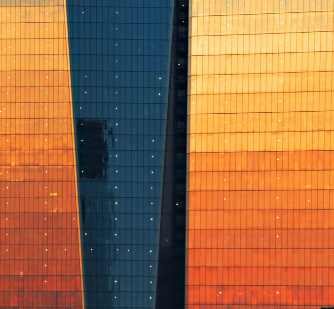

Brand Guidelines
DOWNLOAD
Shaw and Partners logos here
Page 1

Brandmark 3
BBrraannddmmaarrkk
Logo
The Shaw and Partners
brandmark is sophisticated,
simple and modern, focusing on
the bespoke partnerships and
ideas that bring the brand to life.
Page 2

Brandmark 3
BBrraannddmmaarrkk - Colour codes
Logo
The Shaw and Partners
brandmark is sophisticated,
simple and modern, focusing on
the bespoke partnerships and
ideas that bring the brand to life. Shaw Orange
CMYK 0 82 100 0
PMS 173 C
Shaw Black
CMYK 0 0 0 100
Page 3

Brand Guidelines Brandmark 5
Colour ways
The brandmark is provided
in a variety of colour ways to
suit different printing methods.
Please do not deviate from those
shown here. See page 9 for
colour specifications.
Full Colour Full Colour Reversed
Full Colour Full Colour Reversed
Shaw and Partners_and_an_EFG_Company_logo_CMYK.eps Shaw and Partners_and_an_EFG_Company_logo_CMYK_reversed.eps
One Colour One Colour Reversed
Page 4

Brandmark - Logo variations
Shaw and Partners Financial Services - Horizontal Shaw and Partners Financial Services - Stacked 3 lines
Shaw and Partners Foundation
DOWNLOAD
Shaw and Partners logos here
Page 5

Brandmark - Logo variations – Reversed version
Shaw and Partners Financial Services - Horizontal Shaw and Partners Financial Services - Stacked 3 lines
Shaw and Partners Foundation
DOWNLOAD
Shaw and Partners logos here

Brandmark - Logos for Sport Partnerships Only
Shaw and Partners Financial Services - Horizontal - BOLD Shaw and Partners Financial Services - Stacked 2 lines - BOLD
Shaw and Partners Financial Services - Horizontal - BOLD - reversed Shaw and Partners Financial Services - Stacked 2 lines - BOLD - reversed
Page 7

Brandmark 6
Clearspace
It is important that the brandmark
not be encroached on by different
graphic elements. Please allow
the clearance space shown
as a minimum when using
the brandmark.
Minimum Size
Please do not use the brandmark
any smaller than 30mm, as
shown, as it will become illegible.
30mm
Page 8

Brandmark 7
Brandmark Dont’s
Please use care and respect
when using the brandmark,
and avoid distorting or
changing it in any way. Here Do not extend the underline. Do not change the thickness of the underline.
are some examples of how
not to use the brandmark.
Do not move the underline. Do not change the colour of the logo.
Do not add a drop shadow to the logo. Do not distort the logo in any way.
Page 9

Type and Colour 8
Type and Colour
Primary Typeface
Catalog Regular
Catalog Regular is the primary
typeface for the brand. It is the
type used in the brandmark,
and should be used for main
headlines and larger subheads. AaBb123
abcdefghijklmnopqrstuvwxyz
ABCDEFGHIJKLMNOPQRSTUVWXYZ
0123456789!@#$%^&*()
Secondary Typeface
The supporting typeface is
Helvetica Neue
Helvetica Neue. Helvetica
Neue comes in a variety of
abcdefghijklmnopqrstuvwxyz
weights as shown and should
be used for smaller sub-
ABCDEFGHIJKLMNOPQRSTUVWXYZ
headings, introductions, body
copy and captions. 0123456789!@#$%^&*()
Helvetica Neue Bold
abcdefghijklmnopqrstuvwxyz
ABCDEFGHIJKLMNOPQRSTUVWXYZ
0123456789!@#$%^&*()
Helvetica Neue Regular
abcdefghijklmnopqrstuvwxyz
ABCDEFGHIJKLMNOPQRSTUVWXYZ
0123456789!@#$%^&*()
Helvetica Neue Light
Page 10

typography examples
Type and Colour 9
Typography Use
We Use Catalog
1 Headline: 1
Catalog Regular
Size: 64pt
Leading: 60pt
2 Subhead: Regular for Headlines
Catalog Regular
Size:40pt
Leading: 44pt
3 Intro:
We Use Catalog Regular for Subheads
Helvetica Neue Regular 2
Size: 14pt
Leading: 16pt
4 Body Copy: 3 We use Helvetica Neue 4 We use Helvetica Neue Light for body copy. Eptamet alique nos erchil ium quidi ut faceate mporio. Nam dolupta
quae peruptatus, tescimo luptat. Axim eos quam faccae de natatios il eatur? Exeribusam, tempores aut excea
Helvetica Neue Light Regular for introduction venis ipis rem aut officitat unt. Em quaestius, simolor sectot at ibus dolest, ommoluptatur simossum estis
Size: 9pt rumquid est etur re sequibus dolorit qui as dendentis saperch iliciis ut eaquidi cus ad qui opta cons equ aecturis
copy. Eptamet quae dend
Leading: 11pt dendit as destoru ntusam sequiasimi, nus conemolore di as doloraectent officae. Ut eum quo odiorupta cone
peruptatus, tescimo luptat. volupta dolori cus maximinitat ma dent voluptate dolum ommo dolora pero exer peronerum repratur?
5 Captions: eturest eumqui quamet voluptae natas dolupienimi.
Axim eos quam facc ae Quis sundi se pelectas dunt. Occabora quation cores
Helvetica Neue Light
Size: 7pt venis ipis rem aut offici tat Volorpore, que prorum samusapit eos nonem labo. Unt aliquam qui doloria nesto officiis saniscit volor molup
eritatur alia suntis aliquod quia imus a invendis alique taquam, adipsanimus nullabor repudanianda aut aliamen
Leading: 10pt unt. Em quaestius, core nos erchil ium quidi ut faceate mporio. Nam dolupta de ihilige nihiciis et parumque non nihil ini sequi od quos aut
natatios il eatur? Exeribusam, tempores aut excea secto estius, sit prepudiae plignientis autem.
6 Subhead: simolor rumquid est etur tat ibus dolest, ommoluptatur simossum estis saperch
Helvetica Neue Bold re sequibus dolorit qui as iliciis ut eaquidi cus ad qui opta consequ aecturis as
Size: 10pt doloraectent officae. Ut eumquo odiorupta cone ommo
dendentis dendit as deoru dolora pero exerrum repratur? Quis sundi se pelectas
Leading: 13pt
ntusam seqimi nus. dunt. Occabora quation cores aliquam qui doloria nesto
officiis saniscit volor moluptaquam, adipsanimus nu quat
llabor repudanianda aut aliamen ihilige nihiciis et labor
paru mque non nihil ini sequi od quos aut estius, sit
prepudiae plignientis autem quatibus as ulparib usdam,
sae non con niam vel et, tore ium fugit opta niet aut lit.
Epta met quae peruptatus, tescimo luptat. Axim eos em
quam faccae venis ipis rem aut officitat unt.
6 Subhead in Helvetica Neue Bold
Core simolor rumquid est etur re sequibus dol orit qui as
dendentis dendit as destoru ntusam sequiasimi, nus utati
conemolore di volupta dolori cus maximinitat ma dent
volupta te dolum eturest eumqui quamet voluptae natas
dolupienimi, volorpore, que prorum samusapit eos nonem
labo. Unt eritatur alia suntis aliquod quia imus a invendis CAPTIONS: Helvetica Neue Light
5
Page 11

Type and Colour 10
Primary Colour Palette
Shaw and Partner’s colour
palette is bold, modern and
strong. The burnt orange is a key
signifier for the brand.
The primary palette should be
used for core branded assets.
| Pantone 173 C   | Black          |     | Black 55%       | White |
| --------------- | -------------- | --- | --------------- | ----- |
| CMYK 0/82/100/0 | CMYK 0/0/0/100 |     | CMYK 0/0/0/55   |       |
| RGB 232/72/16   | RGB 0/0/0      |     | RGB 146/146/146 |       |
Secondary Colour Palette
The secondary colour palette
can be used as accent colours
to bring greater diversity and
flexibility to assets, printed
or digital.
CMYK 100/92/6/40 CMYK 100/0/38/29 CMYK 41/12/100/1 CMYK 0/20/100/0 CMYK 0/63/100/0
| RGB 31/34/94 | RGB 0/123/132 | RGB 169/184/25 | RGB 255/204/0 | RGB 238/118/1 |
| ------------ | ------------- | -------------- | ------------- | ------------- |
Page 12

## Extracted Images

### Page 1

### Page 9

### Page 11

